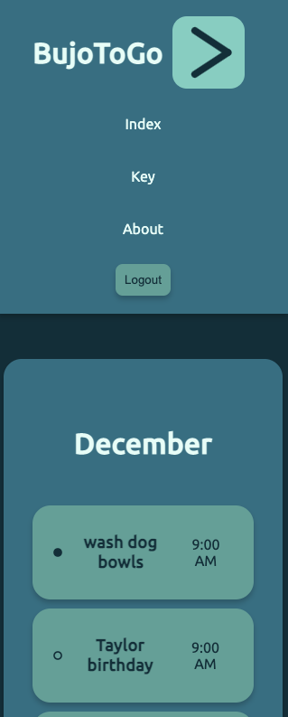
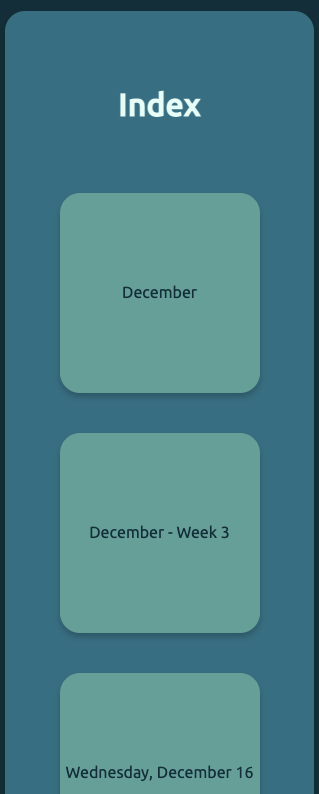
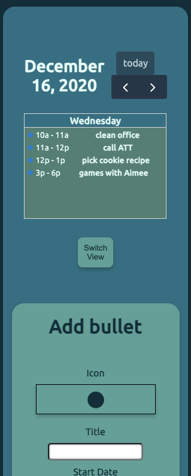
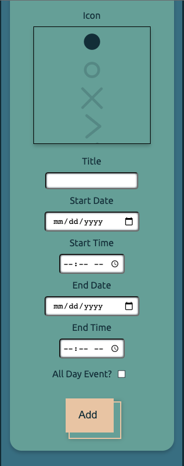

<h1> BujoToGo </h1>


<h2> Summary </h2>

  - [About the Project](#about-the-project)
  - [Usage](#usage)
  - [Videos and Screenshots](#videos-and-screenshots)
  - [Getting Started](#getting-started)
  - [Built With](#built-with)
  - [Authors](#authors)

## About the Project

- BujoToGo is a to do list app based on Ryder Carroll's Bullet Journal system. At its most basic, Bullet Journal is about highly customizable rapid logging, a method of capturing information as bulleted lists. In addition to normal to do list functions, this app allows users to view their bullets in views analogous to popular handwritten traditional and calendar Bullet Journal spreads.

## Usage
- Visit [BujoToGo](http://bujo-to-go.surge.sh/#/index) and click guest login.

- Add, edit, and delete task, event, and note bullets (short descriptions) and migrate them (indicate they've been moved forward to complete later or backward because they were completed early). View your bullets in monthly, weekly, and daily spreads - traditional or calendar style. Bullets are stored with date time strings and returned in chronological order based on the time range of the view.

## Videos and Screenshots







## Getting Started

To set up a local copy of the project follow the steps below.

# Prerequisites

* In an empty folder initialize a new Node.js project.
```sh
npm init
```

# Installation

1. Clone to local machine
```sh
git clone https://github.com/mattquint111/Super-React-Boy
```
2. Install NPM packages
```sh
npm install 
```
3. Start program
```sh
npm start
```

## Built With

- Javascript
- CSS
- [React](https://reactjs.org/)
- [Redux](https://redux.js.org/)
- [React Redux](https://react-redux.js.org/)
- [Redux Persist](https://github.com/rt2zz/redux-persist)
- [React Router DOM](https://reactrouter.com/web/guides/quick-start)
- [Redux Thunk](https://github.com/reduxjs/redux-thunk)
- [Axios](https://github.com/axios/axios)
- [History](https://www.npmjs.com/package/history)
- [Node.js](https://nodejs.org/en/)
- [Express](https://expressjs.com/)
- [Sequelize](https://sequelize.org/)
- [PostgreSQL](https://www.postgresql.org/)
- [Full Calendar](https://fullcalendar.io/)
- [JSON Web Token](https://www.npmjs.com/package/jsonwebtoken)

Deployed with [ElephantSQL](https://www.elephantsql.com/), [Heroku](https://www.heroku.com/home), and [Surge](https://surge.sh/)

## Authors

- **Abbey Perini** - [abbeyperini](https://github.com/abbeyperini)
